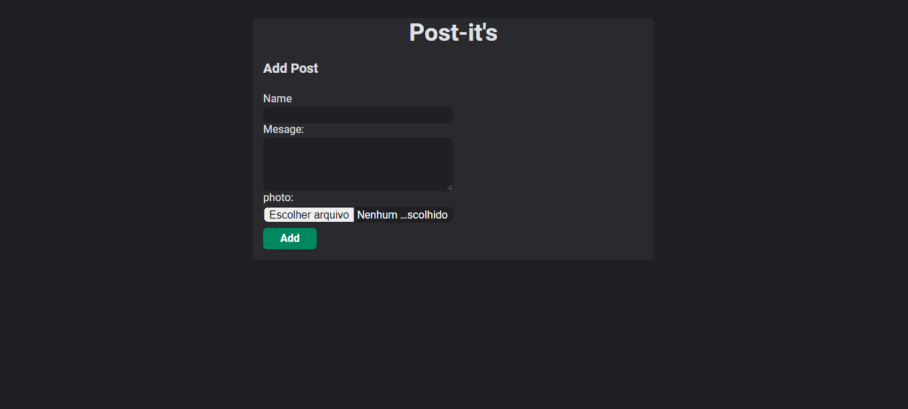

# Post-It's

In this project you can add and revome posts.

React + Styled-components + TS

## Execution

    #npm i
    #npm run dev

## Autores

- [AntonioSilvaAzevedo](https://www.github.com/AntonioSilvaAzevedo)

## Licença

[MIT](https://choosealicense.com/licenses/mit/)

## Screenshots

    

