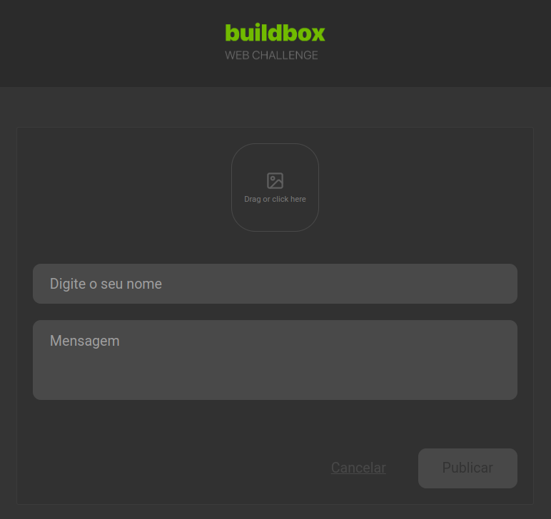

<p align="center">
  
</p>

<p align="center">
  
  
  

  
</p>

<h1 align="center">
BuildBox Mini Blog App
</h1>

<br>

## 🧪 Technologies

This project was developed using the following technologies:

- [ReactJS](https://reactjs.org/)
- [Vite](https://vitejs.dev/)
- [ReactHookForm](https://react-hook-form.com/)
- [Zod](https://zod.dev/)
- [JsonServer](https://www.npmjs.com/package/json-server)
- [ReactHotToast](https://react-hot-toast.com/)
- [ReactQuery](https://tanstack.com/query/v4/docs/framework/react/overview)
- [ReactDropZone](https://react-dropzone.js.org/)
- [StyledComponents](https://styled-components.com/)

## 🚀 Getting started

Clone the project and access the folder.

Run this command to install the dependencies

```bash
npm install

npm run dev
```


## 📝 License

This project is licensed under the MIT License. See the [LICENSE](LICENSE) file for details.

---

Made with 💜 by [Bruno Alves](https://nito-dev.vercel.app/) 👋
