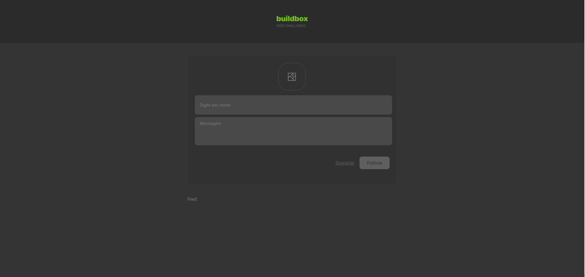
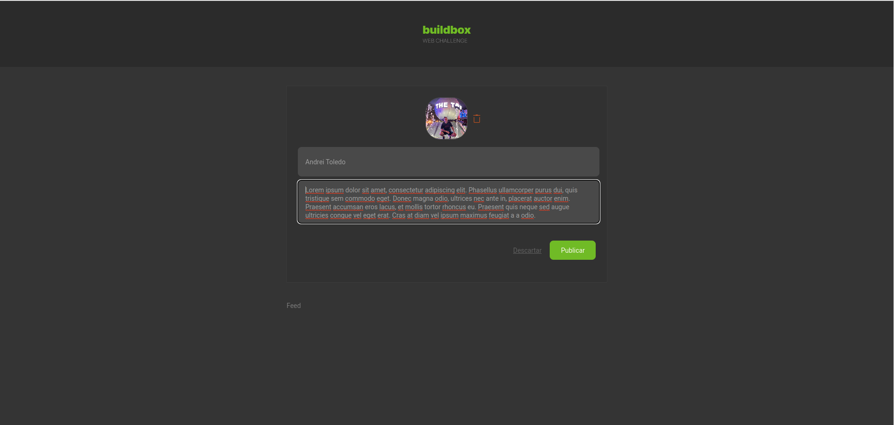
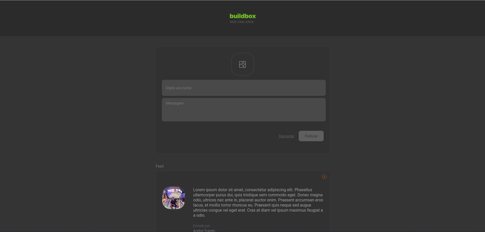
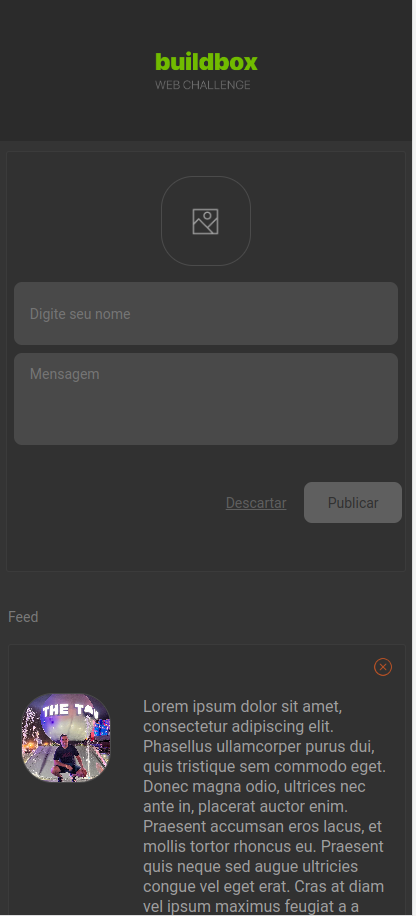

# web-developer-challenge

Olá!

Este desafio consiste em identificar seu conhecimento em desenvolvimento Web, portanto esperamos que você tente resolve-lo usando toda a sua capacidade e conhecimento da tecnologia.

O Desafio é o seguinte:

Monte uma página utilizando React.js que contenha uma lista de posts com a possíbilidade de adicionar e remover. Cada post deve conter nome, mensagem e foto. Não é necessário fazer o Back-End, os dados podem estar apenas em tempo de execução no Front-End.

## O que foi utilizado

 - TypeScript
 - ReactJS (v. 18.2.0)
 - Redux
 - Styled Components

## Como executar

1. Para executar o teste, é necessário baixar o projeto e dentro do diretório dele é necessário executar o seguinte comando para instalar as dependências:
```
 $ npm i
```

2. Agora vamos rodar a versão para debug (versão de desenvolvimento):
```
 $ npm start
```
 Após a execução do comando, uma página do seu navegador irá abrir automaticamente com a aplicação, caso isso não aconteça, você deve entrar em [http://localhost:3000](http://localhost:3000)

3. Caso criar uma versão de produção, é necessário executar o comando
```
 $ npm run-build
```
 Após a conclusão do build, um diretório será criado com o nome `/build`, nele estará contido o build com os arquivos estáticos para serem enviados a um servidor ou abrí-los localmente usando o [Serve](https://www.npmjs.com/package/serve), por exemplo.

 ## Imagens do projeto




