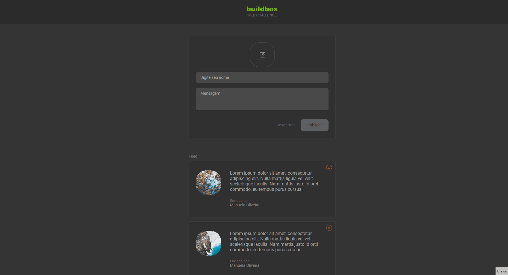

# Buildbox - Web Challenge 🚀

Este projeto é uma aplicação de lista de posts que oferece aos usuários a capacidade de adicionar e remover posts de forma interativa. Desenvolvido com TypeScript, Styled Components e React.

Com uma combinação de elementos dinâmicos e estilos personalizados, esta aplicação oferece uma interface atraente e funcional para os usuários interagirem e compartilharem conteúdo de maneira eficiente e visualmente agradável.

## Tecnologias e Ferramentas 🛠️

## Principais Recursos ✨

- Adicionar novos posts, com campos para inserir nome, mensagem e até mesmo uma imagem opcional. 
 
- Remover posts facilmente com apenas um clique, garantindo uma experiência de gerenciamento de conteúdo intuitiva.

## Protótipo 🎨

Abaixo segue o link do XD com protótipo navegável para conhecer a dinâmica da interface e os dados para Logar no Zeplin para ter acesso ao Design com suas medidas.

## Interface XD
https://adobe.ly/2BVcy5C

## Design - Zeplin
https://app.zeplin.io/login

E-mail - buildbox.guest@gmail.com

Senha - JhZ5dAPG

