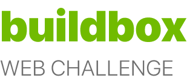
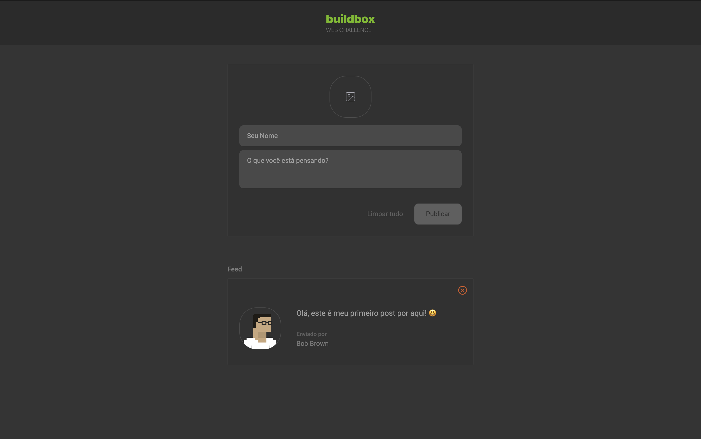

<p align="center">
  
</p>

<p align="center">
  
</p>

Este é um teste técnico feito para a empresa buildbox. A seguir, listei as tecnologias utilizadas para este desafio:

### TECH STACK

- **Typescript**: um _supertset_ do Javascript que facilita a DX (developer experience) e manutenabilidade do código.
- **Tailwind CSS**: um framework de estilos que permite utilizar classes pré-definidas para estilizar a UI.
- **Jotai**: uma biblioteca _lightweight_, orientada a Typescript que gerencia estados globais da aplicação utilizando a abordagem atômica.
- **Vite + Vitest**: Vite é um framework que agiliza a configuração do projeto, oferecendo mais rapidez no desenvolvimento. O Vitest é um poderoso framework de testes nativo do Vite.

### RUNNING PROJECT

Clone o projeto da maneira que preferir, e com o _Yarn_ instalado, rode o seguinte comando na pasta raiz do projeto:

```bash
yarn install
```

Em seguida, inicie o projeto com o comando:

```bash
yarn dev
```

Para executar os testes, basta executar:

```bash
yarn test
```

### Contributing

Sinta-se à vontade para me ajudar a contribuir com alguma correção, aprimoramento ou recurso:

1. Faça um fork do projeto
2. Crie sua branch: `git checkout -b feature/new-feature`
3. Faça o commit das alterações: `git commit -m 'Add new feature'`
4. Faça push para a branch criada: `git push origin feature/new-feature`
5. Abra um pull request

💜 Gosta do que eu faço? Então me compre um café ou chá!
<br />
<br/>
<a href="https://www.buymeacoffee.com/gpaiva" target="_blank"></a>
