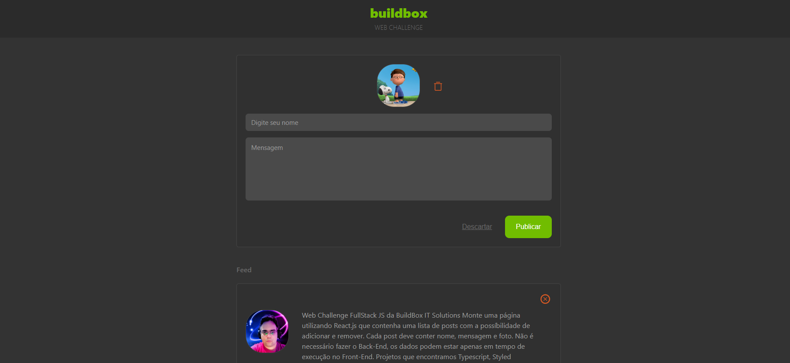

# Desafio Técnico(WebChallenge): FullStack JS BuildBox IT Solutions

  

<a href="#descrição">Descrição do Projeto</a> •
<a href="#tecnologias-utilizadas">Tecnologias Utilizadas</a> •
<a href="#como-rodar-a-aplicação">Rodar a Aplicação</a>

## Descrição
Aplicação com formulário para a criação de uma lista de postagens. 
Nesta aplicação a cada nova postagem criada é formada uma lista de postagens logo abaixo do formulário. 
O usuário pode: 
- adicionar uma nova postagem _*(se não for selecionado uma foto de avatar, a postagem receberá um avatar padrão da BuildBox IT Solutions)*_;
- descartar uma postagem ainda não publicada;
- apagar uma postagem já publicada ja lista de postagens;

## Tecnologias Utilizadas 
- HTML
- CSS
- JavaScript
- TypeScript
- React

## Como rodar a aplicação?
No seu terminal:
- Clone o repositório:  
`git clone git@github.com:prtpj1/web-developer-challenge.git`
- Acesse a pasta do projeto:  
`cd web-developer-challenge/buildbox-posts-app/`
- Instale as dependências:  
`npm install`

#### Opção 1:
- Inicie a aplicação: 
`npm run preview` 

⚠️Aguarde a aplicação abrir no seu navegador. Caso não ocorra, coloque na barra de endereços do seu navegador: ` http://localhost:4173/` _*(esta é a url padrão do vite, mas o terminal pode exibir uma posta diferente de `4173`)*_

#### Opção 2:
- Faça o 'build' da aplicação:  
`npm run build`  
- Inicie a aplicação abrindo o arquivo `index.html` no seu navegador que está na pasta (`./buildbox-posts-app/dist/index.html`) 

 
 

_*OBS: Se tiver alguma dificuldade com as instruções e quiser dar um feedback me mande uma mensagem*_