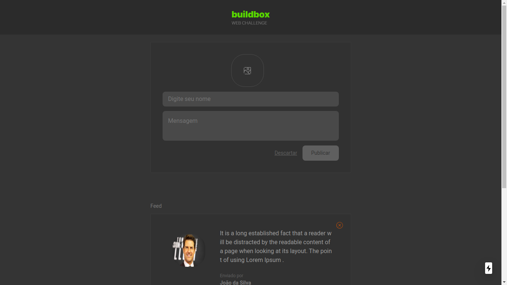
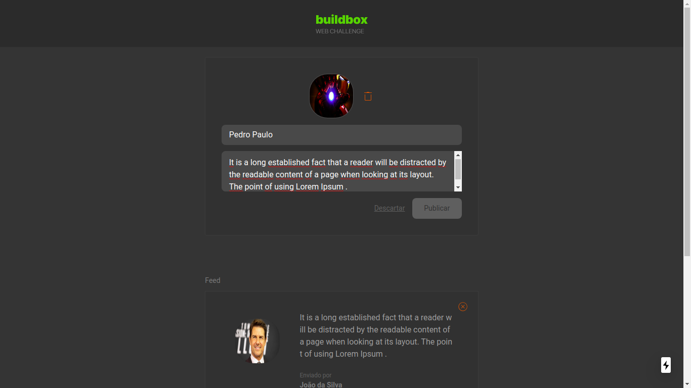
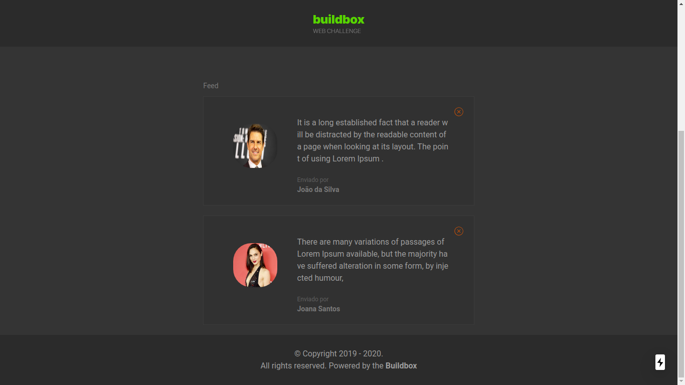

# Web developer challenge 


  <p>
    
    <br>
    <br>
    <br>
    
    <br>
    <br>
    <br>
    
    <br>
    <br>
    <br>
  </p>

  ## How to use

```bash

git clone https://github.com/hudsonfranca/web-developer-challenge.git

```

```bash

cd web-developer-challenge

```

```bash

cd frontend

```

```bash

npm install

```

  ## Available Scripts:

      dev - Runs next dev which starts Next.js in development mode

      build - Runs next build which builds the application for production usage

      start - Runs next start which starts a Next.js production server

      Open [http://localhost:3000](http://localhost:3000) with your browser to see the result.

