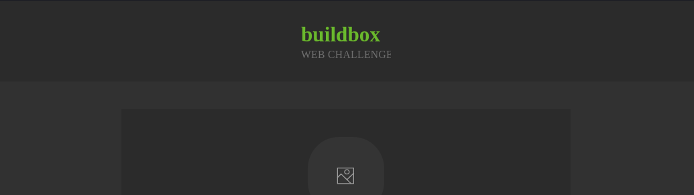

<h1 align="center">
    
    <br>
    BuildBox - Web Challenge
</h1>

<h4 align="center">
  A ReactJS app that allows users to add a new post and remove.
</h4>
<p align="center">
  

</p>

<p align="center">
  <a href="#BuildBox-technologies">Technologies</a>&nbsp;&nbsp;&nbsp;|&nbsp;&nbsp;&nbsp;
  <a href="#information_source-how-to-use">How To Use</a>
</p>

## :BuildBox: Technologies

This project was developed to resolve this challenge with the following technologies:

- [TypeScript](https://github.com/microsoft/TypeScript/#readme)
- [Vite](https://vitejs.dev/guide/)
- [ReactJS](https://reactjs.org/)
- [Style Componets](https://styled-components.com)
- [UUID](https://github.com/uuidjs/uuid)
- [UUID](https://github.com/uuidjs/uuid)
- [VS Code][vc]

## :information_source: How To Use

To clone and run this application, you'll need [Git](https://git-scm.com), [Node.js v10.16][nodejs] or higher + [Yarn v1.13][yarn] or higher installed on your computer.

From your command line:

```bash
# Clone this repository
$ git clone https://github.com/WalleksMR/web-developer-challenge.git
# Go into the repository
$ cd web-post
# Install dependencies
$ yarn install
# Run the app (WEB)
$ yarn dev
```

---

Made with ♥ by Walleks Miranda : [Get in touch!](https://www.linkedin.com/in/walleks-miranda-b291bb1aa/)

[nodejs]: https://nodejs.org/
[yarn]: https://yarnpkg.com/
[vc]: https://code.visualstudio.com/
